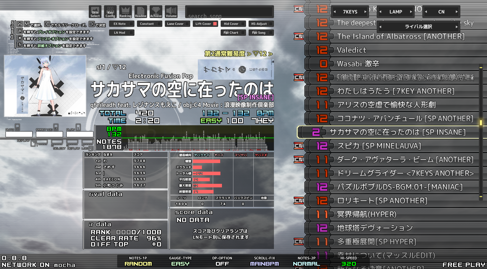

# beatoraja subdiff sabun

beatoraja の選曲画面などで難易度表の難易度を表示するためのスキンの差分情報です。

## m-select

```
beatoraja
├── skin
│   └── m_select
│       ├── customize
│       │   └── advanced
│       │       └── test_subdiff
│       │           └── parts.lua
│       └── enable.txt
└── customize
    └── subdiff
        └── subdiff.lua
```

- `customize/subdiff/` に `subdiff.lua` を配置する
- `test_subdiff/parts.lua` をコピーする
- `m_select/enable.txt` に `test_subdiff/parts.lua` の行を追加する

上手くいくと画像のようになるはずです。



`m_select/customize/advanced/test_bmsanal/parts.lua` を元に作成しました。

## EC:FN

```
beatoraja
├── skin
│   └── ECFN
│       ├── decide
│       │   └── decidemain.lua
│       └── RESULT
│           └── result.lua
└── customize
    └── subdiff
        └── subdiff.lua
```

- `customize/subdiff/` に `subdiff.lua` を配置する
- `decidemain.lua` を更新する
- `result.lua` を更新する

